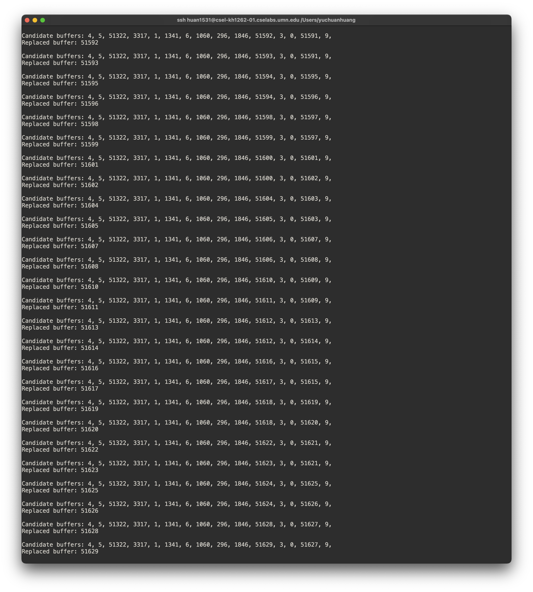

# Part 1: Implement MRU

## Most Recent Used
The basic idea of MRU can be seen in [here](https://en.wikipedia.org/wiki/Cache_replacement_policies#Most_recently_used_(MRU)). However, you will need to adapt the algorithm with the Database buffer management policy concept. 

## Phase1
Please answer the following questions based on the original code of PostgreSQL 14.1:

1. There are five files under src/storage/buffer. What are their jobs? Answer in one sentense.
buf_init.c
buf_table.c
bufmgr.c
freelist.c
localbuf.c

2. What is the original buffer replacement policy/algorithm for PostgreSQL? In which file? In which function? From which line to which line? (4 pts)

3. Which part of PostgreSQL code defines the concept "buffer"? In which file? By which class? (2 pts)

4. Where does PostgreSQL initial each buffer? In which file? In which function? (2 pts)

5. Where does PostgreSQL use each buffer? In which file? In which function? (2 pts)

## Implement MRU in PostgreSQL
Most (if not all) of your changes will be located in the directory: `$W$/postgresql-14.1/src/backend/storage/buffer/`. 

To implement the MRU algorithm, you will want to maintain the timestamp of each buffer when they are used. For simplicity, you will maintain a global integer value which will be assigned to a buffer whenever a buffer page is used, then, increment the integer. Initially, all buffers will have zero timestamp.

## Print out log
To verify the correctness of your implementation, you need to print out the timestamp of all candidates (not in use) buffers: 

`Candidate buffers: <a comma separated list of timestamps>`

and also explicitly print out the timestamp of the buffer that is going to be replaced:

`Replaced buffer: <timestamp>`

An example of expected output is shown below. Please note that your output may have different timestamps, different amount of candidates for each replacement. That is all possible. 

You can print out the log with `printf` function in C programming language. It will print in your **server terminal**. 