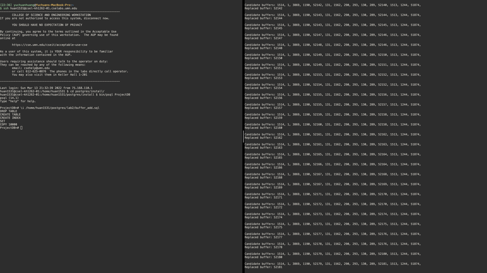

# Part 3: Compile and Test

## Change PostgreSQL config
To test your changes, you will first need to change the memory size of PostgreSQL. Since the test case that is given to you is very small compared to the default memory size of PostgreSQL, it is a good idea to config the memory to a smaller size. 

The configuration is located in: `$W$/install/data/postgresql.conf`. You will change the **shared_buffer** size to **shared_buffers = 128kB**.

## Compile your changes
To compile your changes, you must run the following three commands from the source directory, i.e., `$W$/postgresql-14.1`. Remember to shutdown your server before you make a new compiling:

1. Clean previous make.

<pre><code>make clean</code></pre>

2. Make

<pre><code>make</code></pre>

3. Install the changes. 
   
<pre><code>make install</code></pre>

If you get no error in this process, you will be able to start and server and client and test your changes. 

## Test your changes
You need two files to run the test:
- `values10k.dat`: contains the data to be inserted into PostgreSQL.
- `buffer_add.sql`: contains the sql to do the insertion.

Download these two files to somewhere with following commands:
<pre><code>wget https://csci4707-umn.github.io/lab-book/resource/lab2/values10k.dat && wget https://csci4707-umn.github.io/lab-book/resource/lab2/buffer_add.sql</code></pre>

You will test your change by inserting data into the database and look at the replaced buffer’s timestamp compared to all other candidate buffers’ timestamp. 

To insert the data to the database, you need:
1. In `buffer_add.sql`, update the `<PATH_TO_values10k.dat>` to the real path to `values10k.dat` on your test machine. 
2. Start the server and the `psql`.
3. In `psql`, execute `buffer_add.sql` with following command, remember to replace `<PATH_TO_buffer_add.sql>` to the real path to `buffer_add.sql` on your test machine. 
<pre><code>\i  &#60;PATH_TO_buffer_add.sql &#62;</code></pre>

An example of running the test is shown below. The terminal on the right is the server terminal and the terminal on the left is the client terminal. 
