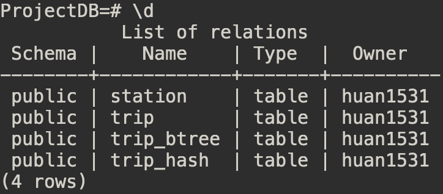

# Part 1: Download and Import Data

## Data Overview
In this lab, you will use the data of bike station and trip information in 2020 and 2021 from [NiceRide](https://niceridemn.com/) in Minneapolis, MN. 

There are two tables in the dataset: **station** and **trip**.

A preview of the **station** table:

| station_id | station_name               |
| ---------- | -------------------------- |
| 2          | 100 Main Street SE         |
| 3          | 25th Street & 33rd Ave S   |
| 4          | Riverside Ave & 23rd Ave S |

A preview of the **trip** table:

| ride_id          | rideable_type | started_at          | ended_at            | start_station_id | end_station_id | member_casual |
| ---------------- | ------------- | ------------------- | ------------------- | ---------------- | -------------- | ------------- |
| 79E701EBAF3B7202 | docked_bike   | 2020-04-01 13:47:57 | 2020-04-01 13:58:29 | 609              | 30009          | casual        |
| 44BCCB23A8E3F931 | electric_bike | 2020-06-09 11:09:03 | 2020-06-09 11:34:12 | 19               | 858            | casual        |
| 50865B1EE60388DF | classic_bike  | 2020-10-22 15:17:43 | 2020-10-22 15:19:56 | 189              | 189            | member        |

We **do not** specify any primary keys or foreign keys for these two tables. The reason is that we want to start the experiment without any index, but ["PostgreSQL automatically creates a unique index when a unique constraint or primary key is defined for a table."](https://www.postgresql.org/docs/14/indexes-unique.html) Conceptually, 

For **station** table, there is:
- station_id PRIMARY KEY
  
For **trip** table, there is:
- ride_id PRIMARY KEY
- start_station_id FOREIGN KEY REFERENCES station(station_id)
- end_station_id FOREIGN KEY REFERENCES station(station_id)

## Download and Import

To download the dataset, run following command in terminal:

<pre><code>wget https://csci4707-umn.github.io/lab-book/resource/lab3/bike_dump.sql</code></pre>

To import the dataset, enter **psql** and run following PostgreSQL command:

<pre><code>\i  &#60;PATH_TO_bike_dump.sql&#62;</code></pre>

To verify a correct importing, use following PostgreSQL command to display all tables in the database:

<pre><code>\d</code></pre>

You should see following list of relations. 

> **!! Important !!** We create two replicas for **trip** table, namely **trip_hash** and **trip_btree**. You will create hash and btree index on these two tables respectively. In order to a fair comparison, do not create two indexes on one table. 

To explore the data type for each column, run following PostgreSQL command in **psql**:

<pre><code>\d  &#60;table_name&#62;</code></pre>

For example, `\d station`

## Finish Lab Report
Answer question 1.1 in lab report.